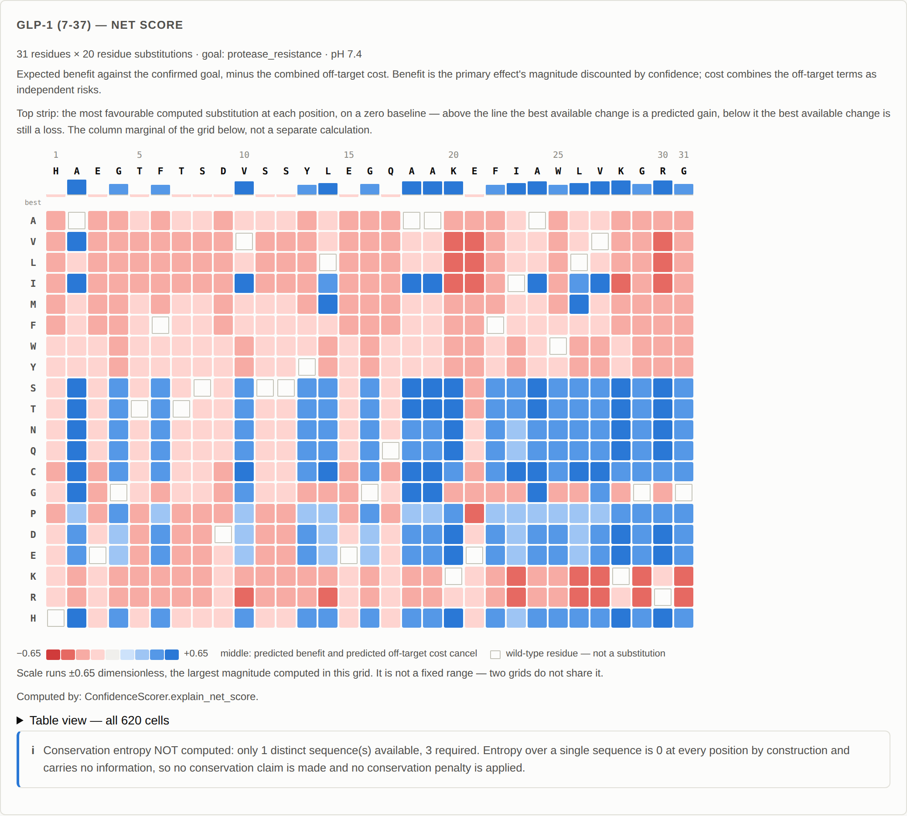
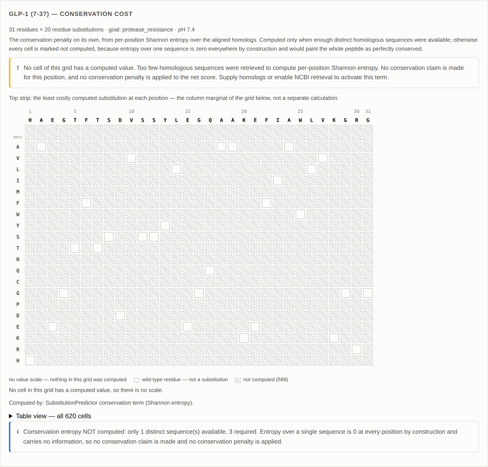
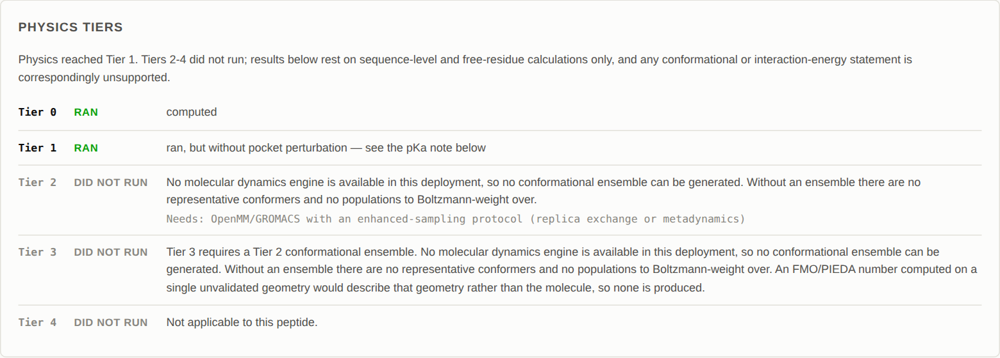
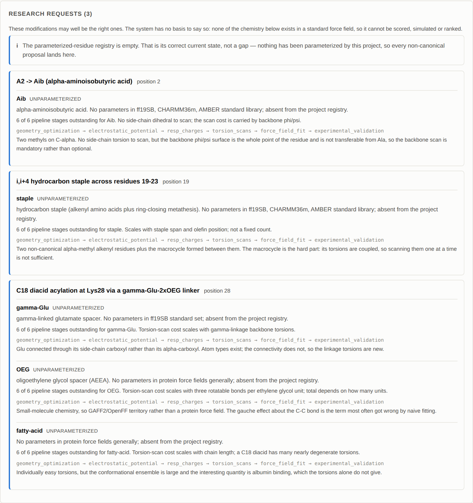
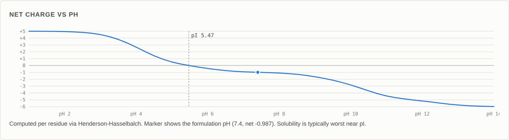
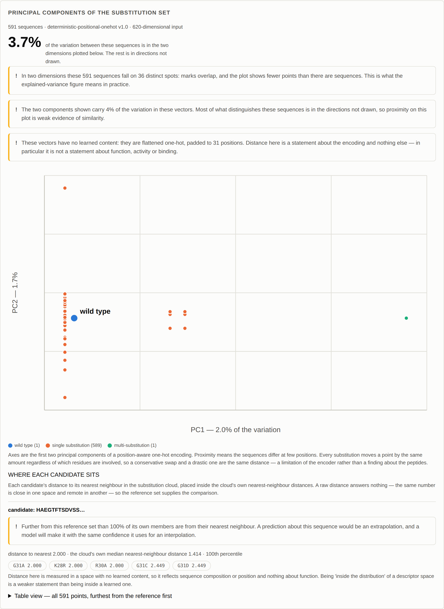
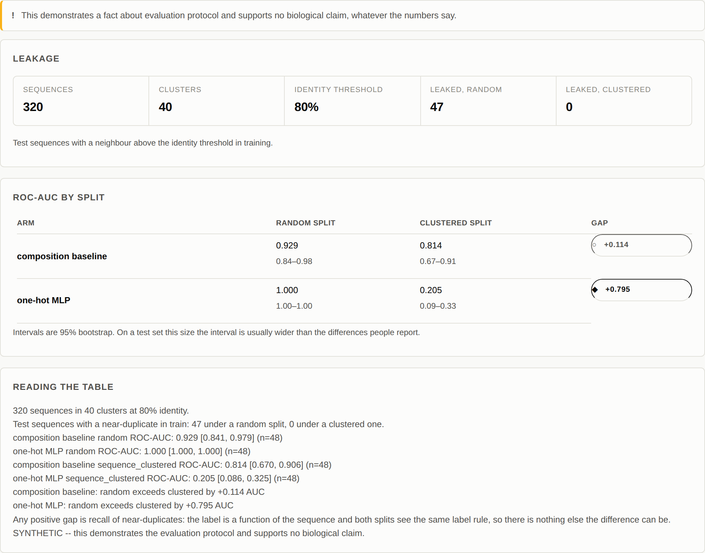

# Peptide-Suite

Peptide engineering analysis with the provenance of every number carried
alongside it.

The organising rule: **a score appears only if it was computed from real input
data.** Where a factor could not be computed — no structure, no assay, no
parameters — the output says so instead of estimating. Most of what follows is
machinery for keeping that true under pressure.

Three workflows:

- **Optimize** — systematic single-position substitution scan against a
  confirmed goal, with each candidate's primary effect, off-target effects and
  confidence reported separately.
- **Transform** — discrete, reviewable modifications scored against an
  eight-objective vector, never collapsed into one number.
- **Find peptides** — functional keywords to capable cell types, checking known
  answers before ranking anything.

And five gates that refuse rather than guess: a structure-template hierarchy
whose last tier is refusal, a parameterized-residue registry that is empty (so
non-canonical chemistry becomes a research request, not a recommendation), a
native-contact classifier that freezes essential footprints, a class B1
placement rule that will not let an affinity gain stand alone as an
improvement, and a synthetic-feasibility check that blocks a regioselectivity
conflict rather than costing it.


## What it looks like

The substitution landscape: every position against every residue, with the
column marginal above it on a zero baseline. Hollow cells are the wild-type
diagonal.



The same grid under a quantity nothing could compute. Automated homolog
retrieval is not wired up in this build, so the conservation term has no input
— and every substitution cell is hatched rather than filled with the zero that
would have painted the peptide as perfectly conserved end to end.



A transformation's objective vector. Three axes were assessed; five were not,
and they are hatched rather than scored neutral, because an unassessed axis
excluded from an average is not an axis with a value of zero. The coverage
figure rides with the scalarised score for the same reason.


What did not run, and why. The physics tiers report their own absence in terms
of the specific engine they would have needed.



Non-canonical chemistry does not become a recommendation. The parameterized
residue registry is empty, so a move that needs chemistry nobody here has
parameterized is emitted as a research request naming what the work would be.



Net charge against pH, computed per residue by Henderson-Hasselbalch rather
than from a table of typical values.



The representation explorer, leading with the share of variation the picture
actually carries rather than with the picture.



Random versus sequence-clustered evaluation, run live rather than served from a
stored table.



## Running

The engine holds no coefficients. Every weight, threshold and cutoff comes from
a policy artifact loaded at startup, and the system refuses to start without
one rather than falling back to built-in values. A demonstration pack is
committed so this repository runs out of the box.

```bash
pip install -r requirements.txt

export PEPTIDE_SUITE_POLICY=policy/demo.v1.json
python -m uvicorn peptide_suite.api:app --reload
```

Then open http://127.0.0.1:8000.

`policy/demo.v1.json` is a demonstration pack: no weight in it was fitted to
data. Every scored response says so, in the API payload and in the UI, so a
number produced under it is never mistaken for a measured one. See
`policy/README.md`.

## Why there is a QM arm

The honest justification, and the one that generalises: for non-canonical
chemistry, quantum mechanics is not an enhancement that sharpens an existing
number. It is the entry ticket to having a number at all.

Aib, Nle, Cha, N-methylated backbones, beta-amino acids, hydrocarbon staples,
fatty-acid linkers, gamma-Glu and OEG spacers — none of these exist in ff19SB,
CHARMM36m, or any standard library. A force field asked to simulate one either
refuses or silently substitutes something else, and the second failure mode is
the dangerous one: it produces a number, the number looks like every other
number, and nothing downstream indicates that the molecule simulated was not
the molecule proposed.

So the system maintains a parameterized-residue registry, and the proposal
engine draws only from it. Getting a residue into that registry means running
the whole pipeline:

    geometry optimization -> ESP -> RESP charges -> torsion scans
      -> fit to GAFF2/OpenFF -> validate against experimental conformational data

Every stage is required. The last one especially: parameters that reproduce the
QM are not the same as parameters that reproduce the molecule.

**The registry is currently empty**, and that is its correct state rather than an
omission. This project has parameterized nothing, so every proposal involving
non-canonical chemistry is emitted as a research request carrying the cost of
parameterizing it — never as a recommendation. On GLP-1(7-36), even with a bound
experimental structure supplied, three of five generated proposals land there:
the Aib substitution, the i,i+4 staple, and the C18 diacid with its gamma-Glu
and OEG linkers.

That cost is stated rather than invented. It says which pipeline stages remain
and what the expensive stage scales with — Aib has no side-chain dihedral to
scan but needs its backbone phi/psi surface mapped, a staple's cost scales with
its span, an OEG spacer's with the number of glycol units. It does not say hours
or dollars, because those depend on hardware, level of theory and how much of
the work is already automated, and a figure here would travel downstream as
though it had been estimated.

One residue class in the catalogue needs no new parameters: a D-enantiomer of a
canonical amino acid. Standard force-field functional forms are achiral, so the
bonded and non-bonded terms are the L values and the inversion is carried by the
sign of the C-alpha improper dihedral. What still has to be checked is that the
improper is actually set for the D configuration — a silently-L improper gives
the wrong enantiomer and reports no error.

This gate is independent of the structure-template gate. A proposal can have a
perfect bound experimental structure and still be unrankable because its
chemistry has no parameters, and the two refusals have different remedies: one
needs a structure, the other needs weeks of QM. Both are reported, because
suppressing one because the other fired would understate what the proposal
actually needs.

## Why the grid hatches instead of filling

The substitution landscape shows the whole scan — every position against every
residue — rather than the five recommendations the optimize tab reports.
Position runs along the x-axis, the twenty residues down the y-axis grouped by
side-chain chemistry, and each cell carries one computed quantity: net score,
off-target cost, the conservation penalty on its own, charge change, or
hydrophobicity change.

The interesting part is what happens to a cell with no number behind it.

A heatmap wants a value everywhere, and the tempting default for "nothing to
report" is the middle of the scale. On a diverging ramp the middle means *no
change*, which is a claim about the chemistry. "No conservation data" is a
different claim, and the two must not share a cell. So a cell the pipeline did
not compute is hatched, carries no `value` key on the wire at all, and states
its reason on hover and in the table view.

This is not hypothetical. Automated homolog retrieval is not wired up in this
build, so without pasted homologs the conservation term has nothing to compute
from — and the conservation metric comes back with all 589 substitution cells
hatched and none coloured. Entropy over one sequence is zero at every position
by construction; filled in, it would have painted the peptide as perfectly
conserved end to end. Supply three distinct homologs and the same grid fills.

Above the grid sits its column marginal: for each position, the most
favourable computed substitution available there, on a zero baseline. Above the
line the best available change is a predicted gain; below it, the best
available change is still a loss, which is the answer to "which positions
tolerate change at all" and is invisible in a ranked top-five list. It is a
reduction of the same cells rather than a second calculation, so it cannot
disagree with the grid under it — and a column with nothing computed is hatched
rather than drawn as a bar of no height, because a bar of no height is a claim
that nothing helps.

Two smaller rules follow from the same idea. The wild-type diagonal is its own
state — not a substitution with no effect, not a substitution. And a one-signed
quantity does not get a diverging scale: off-target cost runs 0..1 with no
meaningful midpoint, so it declares a sequential encoding and gets one hue,
while only genuinely signed quantities get two poles and a neutral middle.

The colour scale is derived from the grid in front of you, not fixed, and says
so underneath: a scan whose scores all fall within ±0.3 drawn against a
theoretical ±1.0 is a uniformly pale chart that hides its own result. Two grids
therefore do not share a scale, which is stated rather than left to be assumed.

## Why sequence-aware evaluation matters

Peptide datasets are full of near-duplicates: alanine scans, single-point
variants, truncation series, the same peptide from two papers. A random split
puts a peptide in train and its point mutant in test, and the model gets credit
for recalling a sequence it has already seen. The score is real; what it
measures is memorisation.

`ml/experiments/split_gap.py` settles this rather than asserting it. Forty
families of related sequences, a label that is a genuine function of the
sequence (a motif present or absent), and two splits over the same data:

| Arm | Random split | Sequence-clustered split | Gap |
|---|---|---|---|
| Composition baseline | 0.929 AUC | 0.814 AUC | +0.114 |
| One-hot MLP | **1.000 AUC** | **0.205 AUC** | **+0.795** |

47 of 48 test sequences have a ≥80%-identity neighbour in training under the
random split. Zero do under the clustered one.

Two things to read off that table.

The MLP's 1.000 is entirely recall. Held-out families drop it to 0.205 — *below
chance*, meaning it learned family-specific patterns that actively mislead on
sequences it has not seen. The composition baseline cannot represent a specific
sequence at all, so it has less to memorise and loses far less.

And the deep model looks better than the baseline on the random split (1.000 vs
0.929) and is much worse on the honest one (0.205 vs 0.814). Reported the usual
way, this experiment would have concluded that the neural model wins.

The clustering is union-find single-linkage, and the guarantee is exhaustively
tested: no two sequences in different clusters are within the identity
threshold. Greedy first-match assignment does not provide that — a sequence
similar to members of two clusters joins only the first, and the pair it leaves
behind straddles the split. That leaked three sequences past a clustered split
before it was fixed.

This experiment is marked `SYNTHETIC_METHOD_ONLY` in the dataset registry. It
demonstrates a fact about evaluation protocol and supports no biological claim.

## The representation explorer, and why it leads with a number

A reference peptide and every single substitution of it, projected onto their
first two principal components. The scatter is not the headline. The headline
is the share of variation the two drawn dimensions actually carry, shown at
size above the plot, because a picture carrying 19% of the variation is a
picture in which proximity means very little and a reader is entitled to know
that before reading anything off it.

Three things ride with every projection:

- **Explained variance, per component and cumulative.** Without it the axes are
  unlabelled.
- **Which encoder made the vectors.** Distance in a deterministic descriptor
  space is a statement about amino-acid composition. In a pretrained
  language-model space it would be a statement about what the model learned.
  Those are different claims, and the projection says which one it is making.
- **A refusal to mix spaces.** Two vectors of equal dimension from different
  models occupy unrelated spaces, and a PCA over the mixture produces axes that
  mean nothing. That is checked, not assumed.

PCA rather than UMAP, deliberately: UMAP's layout depends on hyperparameters
that change cluster structure, has no explained-variance analogue, and its
distances are not metric, so all three statements above would become
unstatable.

The two deterministic encoders are kept separate rather than merged, because
their limitations are opposite and both are worth seeing. Composition
concentrates variance into few components and is order-blind — under it roughly
half of a single-substitution scan lands exactly on top of something else.
Positional one-hot keeps all 591 apart and spreads the variance so thin that
two components carry about 4% of it. The positional one is the default: a plot
that silently merges half its points is worse than one whose components carry
little and say so.

Both kinds of collapse are counted and reported, because they mean different
things and a reader counting marks deserves to know which is happening. "591
sequences occupy 591 distinct positions in this space" is about the encoder.
"In two dimensions these 591 sequences fall on 36 distinct spots" is about the
projection — and is what a 4% explained-variance figure means in practice.

Neither encoder has any learned content, and neither is reported as though it
does. ESM-2 is the intended encoder; its weights are unreachable from this
environment and it raises rather than falling back, so nothing here can report
amino-acid counts as a language-model embedding.

Supply candidate sequences and each is placed inside the substitution cloud's
own nearest-neighbour distance distribution — "further from this reference set
than 100% of its own members are from their nearest neighbour" — because a raw
distance answers nothing: the same number is close in one space and remote in
another. A reference set too small to have a spread is refused rather than
given a verdict. The point of the warning is narrow and worth stating plainly:
a prediction about a sequence unlike anything in the reference set is an
extrapolation, and a model will make it with exactly the same confidence it
uses for an interpolation.

Attribution is deliberately absent. It explains a model's output, and the only
model available here is the synthetic split-gap demonstration; attributing its
recall of constructed sequences would be a picture of nothing. It arrives with
the labelled data. Residue-level sensitivity is not duplicated either — the
substitution landscape's column marginal already answers it, over the real
pipeline rather than over a model.

## Why named-entity holdouts overstate the result

The obvious way to test whether the system can rediscover a known drug is to
remove every document mentioning it and see whether the modifications come back.
For semaglutide that protocol does not hold, and the reason is checkable from
the data rather than rhetorical.

Semaglutide carries four engineering motifs: Aib8, Arg34, a C18 diacid, and a
gamma-Glu linker. After excluding every document naming semaglutide:

| Motif | Still present in |
|---|---|
| Aib | taspoglutide, tirzepatide |
| lipidation | liraglutide, tirzepatide, insulin degludec |
| gamma-Glu linker | liraglutide, tirzepatide, insulin degludec |
| regioselectivity substitution | liraglutide |

Every motif survives. Liraglutide carries Arg34 and gamma-Glu-linked acylation
at Lys26; taspoglutide is [Aib8, Aib35]-GLP-1. The union of two other published
drugs is the complete answer, so what such an experiment demonstrates is correct
retrieval and recombination of established engineering motifs.

That is a real and useful capability and the system claims exactly that. It is
not evidence of de novo discovery, and `GET /api/holdout` will produce the table
above for any drug in the golden set.

Three protocols replace it: motif-level ablation (exclude by chemistry, not by
name), temporal holdout (freeze the corpus at a cutoff year), and decoy controls
(run on peptides where the motif is known not to help — a system that proposes
it anyway has a prior, not a prediction).

**Results are never reported as a binary hit.** The contract is the rank of the
true modification within the full proposal list, plus the count ranked above it,
plus the decoy false-positive rate:

> 'Aib8' ranked 2nd of 47 proposals, with 1 ranked above it under motif_ablation
> (ablated: aib). 'aib' was proposed in 2 of 18 decoy trials (false-positive rate
> 0.11).

"Predicted two of three modifications" is not supportable. The sentence above
is. `RankedOutcome` has no boolean hit field anywhere on it, because a system
whose output can be reduced to yes-or-no will be — and 2nd of 47 would get
written up alongside 2nd of 3.

## API

Typed request and response schemas; interactive docs at `/docs` when running.

| Endpoint | Purpose |
|---|---|
| `POST /api/infer-function` | Identify a sequence or name, and propose a goal for confirmation |
| `POST /api/optimize` | Run the substitution scan against a confirmed goal |
| `POST /api/substitution-landscape` | The same scan as the full position x residue grid, unranked |
| `GET /api/landscape-metrics` | The selectable quantities and the encoding each is entitled to |
| `POST /api/transform` | Ranked transformations, objective vectors, gates and research requests |
| `POST /api/find-peptides` | Functional keyword search |
| `POST /api/ml/representation` | Reference and single substitutions in two principal components, with each candidate placed against the cloud |
| `GET /api/policy` | Which policy produced the numbers, and how much of it is placeholder |
| `GET /api/parameterization` | The residue registry and the pipeline that would fill it |
| `GET /api/holdout` | Holdout protocols, and the named-entity leakage table |
| `GET /api/goals` | Goals with a real scoring path |
| `GET /api/calibration` | Prediction-vs-outcome log summary |
| `GET /api/health` | Liveness |

Every scored response carries its policy provenance, so a number cannot be read
without knowing what weighted it.

## Tests

```bash
python -m unittest discover -t . -s peptide_suite/tests
```

`-t .` matters. It lets the test package load the demonstration pack before any
test imports — without it the suite fails at the first coefficient read, which
is the boundary working as intended rather than a broken suite.

```bash
python tools/check_policy_boundary.py --scope all
```
